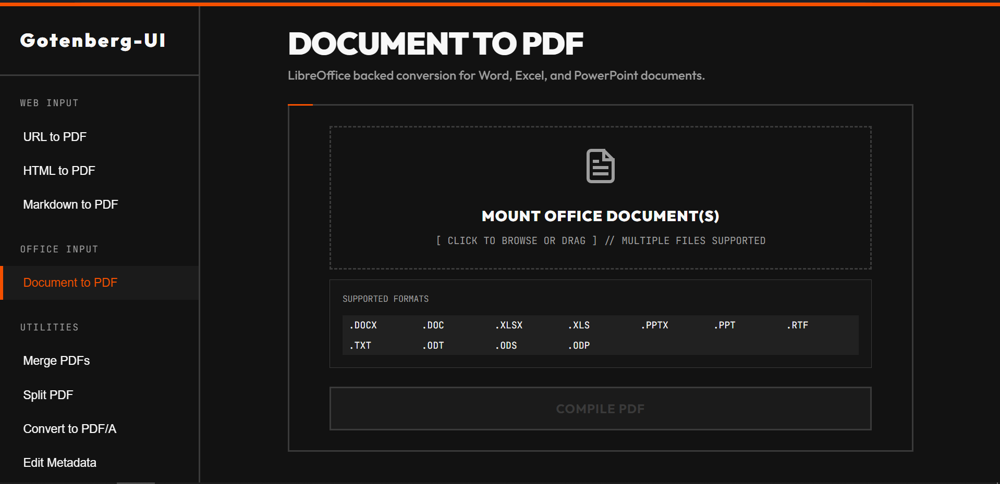

# Gotenberg UI



A clean, self-hosted web UI frontend for the powerful [Gotenberg](https://gotenberg.dev/) document conversion API.

---

## 🛠️ Features

### **Web & Office Conversion**
- **URL to PDF**: Render remote web pages using Chromium.
- **HTML to PDF**: Convert multi-file HTML assets with full CSS support.
- **Markdown to PDF**: Professional document generation from Markdown.
- **Office to PDF**: Convert Word, Excel, PowerPoint, and Text files (LibreOffice powered).
  - Supports **Merging** multiple office files into a single PDF during conversion.

### **Advanced PDF Utilities**
- **Merge PDFs**: Consolidated multiple PDF sources with forced reordering.
- **Split PDF**: Extract specific page ranges or individual sheets.
- **Convert to PDF/A**: Enforce archival standards for long-term storage.
- **Edit Metadata**: Side-by-side inspection and modification of document properties.
- **PDF Security**: Encrypt documents with User/Owner passwords.
- **Flatten PDF**: Make interactive form fields and annotations static.

### **UI & Experience**
- **Mobile Responsive**: Fully usable on phones and tablets.
- **Operation History**: Local log of recent operations.
- **Modern Design**: Clean, high-performance interface.

---

## 🚀 Deployment

### **Quick Start**
The easiest way to get started is to use Docker Compose. Create a `docker-compose.yml` file with the following content:

```yaml
services:
  gotenberg:
    image: gotenberg/gotenberg:8
    ports:
      - "3000:3000"

  gotenberg-ui:
    image: ghcr.io/aadisprabs/ui_gotenberg:latest
    ports:
      - "8080:8080"
    environment:
      - GOTENBERG_URL=http://gotenberg:3000
    depends_on:
      - gotenberg
```

Then, run:

```bash
docker compose up -d
```

Access the UI at `http://localhost:8080`.

---

## 🏗️ Technical Architecture
- **Frontend**: Vite + React, Vanilla CSS
- **Engine**: [Gotenberg 8](https://github.com/gotenberg/gotenberg)
- **Reverse Proxy**: Caddy v2

---

⭐ **Star this project if you found it useful or like it!**
